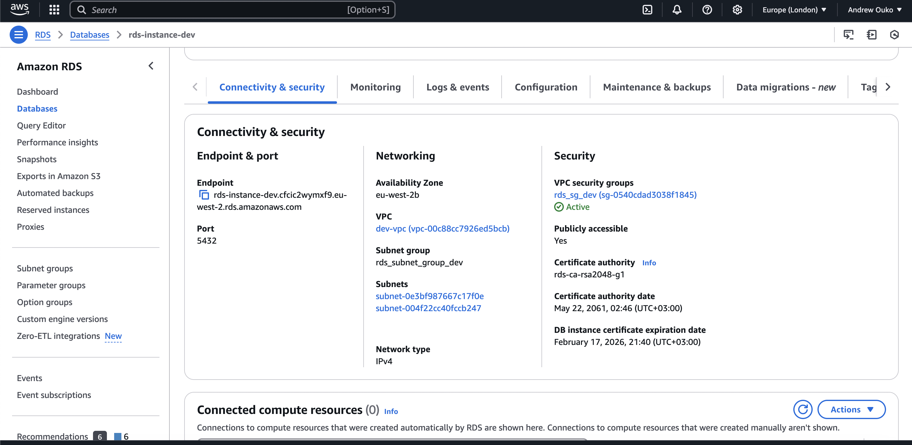

# Simple AWS Terraform Deployment

This project sets up a simple AWS infrastructure using Terraform. It includes an S3 bucket for static file storage, a Lambda function, and an HTTP API Gateway to expose the Lambda function.

## Prerequisites

- [Install Terraform](https://developer.hashicorp.com/terraform/tutorials/aws-get-started/install-cli)
- AWS CLI configured with appropriate credentials
- Create a `secrets.tfvars` file with `db_username` and `db_password` values at the root of the project. NB: The username cannot be admin (reserved).

```sh
export AWS_ACCESS_KEY_ID=<Your aws access key>
export AWS_SECRET_ACCESS_KEY=<Your aws secret access key>
```

OR

```sh
aws configure
```

## Setup Instructions

### 1. Transpile the lambda source code

Navigate to the project directory and build the lambda code

```sh
cd simple_lambda
npm i
npm run build
```

### 2. Initialize the Terraform Project

Navigate to the project directory and initialize the Terraform project:

```sh
terraform init
```

### 3. Create and Switch Workspaces

Create and switch to the desired workspace (e.g., dev, staging, prod): The workspace can be used to deploy resources to different environments. The terraform code uses workspace property to deploy resources to different environments

```sh
terraform workspace new dev
terraform workspace new prod
```

```sh
terraform workspace list
```

```sh
terraform workspace select dev
```

OR

```sh
terraform workspace select prod
```

### 4. Plan the Configuration

It is good practice to Run terraform plan to see the changes that will be made by the configuration:

```sh
terraform plan -out=tfplan -var-file="secrets.tfvars"
```

### 5. Apply the Configuration

If there are no issues after running the plan, apply the Terraform configuration to create the resources using the created plan:

```sh
terraform apply tfplan
```

### 6. Verify the Deployment

After applying the configuration, you can verify the deployment by checking the outputs.

1. The API Gateway URL will be displayed as an output.
2. The RDS endpoint url will displayed as an output.

## Cloud Resources provisioned by Terraform

### 1. Lambda Function

The `lambda.tf` file is used to create a Lambda function for different environments (workspaces). It includes the following resources:

1. Creates a zip file containing the source code for the Lambda function at the root of the project - `simple_lambda.zip`.
2. The actual lambda function named - `simple_lambda_${env name}`.
3. Properties of the lambda:

- uses Node 20 runtime
- has 1 environment variable `ENV` to show the environment variable we are running on
- use the handler function of the index.js file in the source code as the entry point
- Has a VPC configuration that allows it to connect to all resources in the VPC using the `lambda_sg` security group (firewall). More details in the **Network Configuration** section.

You should see two lambdas.


The environment variables for the lambda


### 2. S3 Bucket

The s3.tf file creates a single S3 bucket in each environment (workspace). It includes the following resources:

1. The actual s3 bucket named - `simple-bucket-${env name}`.

You should see 2 buckets after applying both workspaces.


### 3. HTTP API Gateway

The `simple_http_api_gateway.tf` file creates HTTP API Gateways for each environment (workspace) to expose the Lambda functions. It includes the following resources:

1. A HTTP API Gateway - we can also use a REST API but for this simple demonstration a HTTP API suffices.
2. Integrates the API Gateway with the Lambda function using the `POST` method. We also use the  `AWS_PROXY` type so that the lambda can handle the request and response.
3. Add a `HTTP POST` route name `/hello` to invoke the `simple_lambda_${env name}` Lambda function.
4. A deployment stage for each environment for the API Gateway to ensure that is auto deployed.

HTTP API Gateways


HTTP API Gateway Route(s)


Deployment Stages


### 4. IAM Roles and Policies

The `iam.tf` creates the IAM roles and policies for different environments (workspaces). It includes the following resources:

1. A IAM role `lambda_role_${env name}` that (all) lambda functions assume when executing.
2. An IAM policy `full_s3_access_policy` that grants full s3 access to the `simple_static_bucket` s3 bucket. The permission is only granted to one principal:  `simple_lambda_${env name}`.
3. An IAM policy `s3_read_access_policy` that grants read access to the `simple_static_bucket` s3 bucket. The permission is only granted to one principal:  `simple_lambda_${env name}`.
4. Attaches the `AWSLambdaBasicExecutionRole` to the `lambda-role` to allow the principals (all lambdas) to log to cloudwatch.
5. Attaches the `full_s3_access_policy` to the `lambda-role` to allow the principals (only `simple_lambda_${env name}`) full access to the `simple_static_bucket` s3 bucket.
6. Attaches the `lambda_vpc_access_policy` to the `lambda-role` to allow the lambdas to create network interfaces in the VPC.
7. Adds lambda permission with id `AllowAPIGatewayInvoke_${env name}` to allow the API Gateway to invoke the `simple_lambda_${env name}` lambda.

Dev Lambda Role with it's policies


Prod Lambda Role with it's policies


### 5. Network Configuration

The `network.tf` creates the different networking resources for the different environments (workspaces). It includes the following resources:

1. Creates a VPC for each environment with an IP address range of 10.0.0.0 to 10.0.255.255. It enable DNS resolution to resolve domain names to IPs in the dev environment only. Enables DNS hostnames so that instances in this VPC are assigned public hostnames in the dev environment.
2. Create an internet gateway for each environment to handle incoming and outgoing traffic. The gateway is attached to the VPC.
3. Creates two subnets in the VPC within 2 availability zones.
4. Create a public route table for each environment to route all outbound traffic to the internet gateway.
5. Create a route table association to make all the subnets public by associating them with the public route table. This is so that they can route all outbound traffic to the internet gateway.
6. A security group (Virtual Firewall) named `lambda_sg_${env name}` that only allows the `simple_lambda_${env name}` to access the RDS instance. It call sends traffic to any IP and Port.
7. A security group for the RDS instance named `rds_sg_${env name}`. It accepts incoming traffic for the TCP protocol and port 5432. For prod it can only be accessed by only resources in the `lambda_sg_${env name}` security group - currently only the lambda is on this group. For dev we allow all IP addresses to access the RDS instance. It sends traffic to all IPs and Ports.
8. A subnet group named `rds_subnet_group_${env name}` that is used by the RDS instance. Since it uses all subnets in the VPC the RDS instance can access all the availability zones in VPC.

Dev VPC


Prod VPC


Internet Gateways


Subnets


Security Groups


### 6. Database Instance

The `database.tf` creates the RDS instance and outputs its endpoint. It includes the following resources:

1. The RDS database instance named `rds-instance-${env name}`. It has the following properties:

- It uses `postgres` engine
- It is a free tier instance: `db.t3.micro`
- It has 10gb of storage
- It uses the `rds_sg_${env name}` security group as described above.
- It uses the `rds_subnet_group_${env name}` sub net group as described above.
- It does not store a final snapshot of the db when the instance is destroyed.

Dev Database Instance



Dev Connection Rules


Prod Database Instance


Prod Connection Rules


